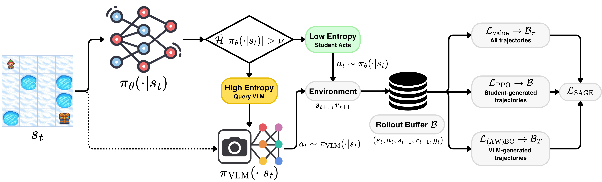

# SAGE: Selective Agent Guidance via Entropy

This repository contains the code for the EMNLP 2026 Findings paper [Selective Agent Guidance via Entropy: Learning Autonomous Policies from Imperfect VLM Teachers](https://arxiv.org/abs/2609.01567).

SAGE trains a small CNN policy with PPO and queries a vision-language model (VLM) teacher only when the policy is uncertain (normalized entropy above a threshold ν). Teacher actions are executed and distilled with an (advantage-weighted) behavior cloning loss, so the learned policy needs no VLM calls at deployment.



## Project structure

- `src/train/`: training loops (`train_ppo.py` for PPO, SAGE, LVLM2P and RL-VLM-F; `train_dagger_vlm.py` for DAgger), the entropy gate (`guidance.py`) and the RL-VLM-F reward model (`reward_shaping.py`)
- `src/eval_vlm.py`: VLM-as-Policy evaluation
- `src/guidance_models/`: teachers (vLLM, Transformers, rule-based oracles, random) and the response cache
- `src/environments/`: environment factory and wrappers, EZPoints and CardMaze (`gym_cards/`), ALFWorld
- `src/agents/`: actor-critic networks
- `config/`: Hydra configs, one per experiment in the paper
- `data/prompts/`: VLM prompts
- `scripts/`: results aggregation and ALFWorld preprocessing

## Installation

We provide a conda environment file:

```bash
mamba env create -f environment.yml
mamba activate sage
```

The VLM teachers are downloaded from the Hugging Face Hub. Gemma requires accepting its license on the Hub and setting a token:

```bash
export HF_TOKEN=<your_token>
export HF_HOME=<cache_dir>  # optional
```

### ALFWorld

ALFWorld needs additional packages, the game data and an X display (a virtual display is started automatically if `DISPLAY` is not set):

```bash
pip install "alfworld[full]" pyvirtualdisplay
export ALFWORLD_DATA=<data_dir>
alfworld-download
python scripts/precompute_receps.py  # optional, caches receptacle maps to speed up resets
```

## Running experiments

Experiments are configured with [Hydra](https://hydra.cc). Each config in `config/` runs the corresponding paper experiment as a multirun over environments and seeds 1-3:

```bash
python -m src.train.train_ppo -cn sage_qwen35
```

| Paper result | Command |
|---|---|
| PPO (Table 1) | `python -m src.train.train_ppo -cn ppo` |
| VLM-as-Policy (Tables 1-2) | `python -m src.eval_vlm -cn vlm_policy_qwen35` |
| LVLM2P (Table 1) | `python -m src.train.train_ppo -cn lvlm2p_qwen35` |
| RL-VLM-F (Table 1) | `python -m src.train.train_ppo -cn rl_vlmf_qwen35` |
| DAgger (Table 1) | `python -m src.train.train_dagger_vlm -cn dagger_qwen35` |
| SAGE (Tables 1-3) | `python -m src.train.train_ppo -cn sage_qwen35` |
| SAGE + Oracle (Tables 1, 3) | `python -m src.train.train_ppo -cn sage_oracle` |
| Gemma3-27B teacher (Table 2) | `python -m src.eval_vlm -cn vlm_policy_gemma27`<br>`python -m src.train.train_ppo -cn sage_gemma27` |
| Random teacher (Table 2) | `python -m src.train.train_ppo -cn sage_random` |
| SAGE w/o AWBC (Table 3) | `python -m src.train.train_ppo -cn sage_qwen35 training.awbc_filter=none training.bc_schedule=constant` |
| SAGE w/o BC (Table 3) | `python -m src.train.train_ppo -cn sage_qwen35 training.bc_coef=0` |
| SAGE + Oracle w/o BC (Table 3) | `python -m src.train.train_ppo -cn sage_oracle training.bc_coef=0` |
| 5M steps (Table 4) | `python -m src.train.train_ppo -cn long_horizon` |
| β and ν sweeps (Tables 7-8) | `python -m src.train.train_ppo -cn sweep_bc_coef`<br>`python -m src.train.train_ppo -cn sweep_threshold` |
| ALFWorld (Table 1) | `python -m src.train.train_ppo -cn ppo_alfworld`<br>`python -m src.eval_vlm -cn vlm_policy_alfworld`<br>`python -m src.train.train_ppo -cn sage_alfworld`<br>`python -m src.train.train_ppo -cn sage_oracle_alfworld` |

To run a single configuration, switch Hydra to a single run and pick the environment and seed:

```bash
python -m src.train.train_ppo -cn sage_qwen35 hydra.mode=RUN env=card_maze_suit_normal \
  training.guidance_model.guidance_threshold=0.25 seed=1
```

To check the setup without a GPU, run one PPO update with the oracle teacher (a few minutes on CPU):

```bash
python -m src.train.train_ppo -cn sage_oracle hydra.mode=RUN env=card_maze_suit_normal \
  training.guidance_model.guidance_threshold=0.25 seed=1 cuda=false \
  env.total_timesteps=512 training.eval_frequency=0 training.eval_episodes=10
```

Runs with a 27B teacher use 2 GPUs (A100 64GB in our experiments); vLLM uses all visible GPUs. Logging goes to Weights & Biases in offline mode by default (`logger.wandb_mode=online|offline|disabled`).

### Cluster

A generic SLURM launcher (via `hydra-submitit-launcher`) is provided in `config/hydra/launcher/slurm_generic.yaml`:

```bash
python -m src.train.train_ppo -cn sage_qwen35 hydra/launcher=slurm_generic \
  hydra.launcher.account=<account> hydra.launcher.partition=<partition>
```

### Other options

The code also includes options that are not used in the paper experiments but may be useful for follow-up work:

| Option | Description |
|---|---|
| `training.guidance_model.uncertainty_method=value_disagreement\|dual` | Gate the teacher on the disagreement of a critic ensemble (`training.agent.num_critic_heads>1`), alone or together with entropy |
| `training.awbc_filter=binary` | CRR binary weights 1[A > 0] instead of exp(A/τ) |
| `training.awbc_return_filter=true` | Apply BC only to teacher actions from episodes with return above `training.bc_return_threshold` |
| `training.exclude_value_loss_when_guided=true` | Train the critic on student transitions only |
| `training.guidance_model.kappa` | Query the teacher only with probability κ in uncertain states |
| `training.guidance_model.random_guidance_prob` | Replace oracle actions with random actions with this probability, for a teacher of controlled quality |
| `training.guidance_model.history_len` | Include the last steps in the VLM prompt |
| `training.guidance_model.use_vllm=false` | Run the teacher with Transformers instead of vLLM |

## Results

Every run writes its evaluation returns and VLM call counts to `metrics.jsonl` in its Hydra output directory. To aggregate them over seeds into the quantities reported in the paper (peak and final return, VLM calls and query rate):

```bash
python scripts/summarize_results.py multirun/
```

## Citation

```bibtex
@inproceedings{bonetta2026sage,
  title     = {Selective Agent Guidance via Entropy: Learning Autonomous Policies from Imperfect {VLM} Teachers},
  author    = {Bonetta, Giovanni and Merler, Matteo and Zago, Davide and Cancelliere, Rossella and Magnini, Bernardo},
  booktitle = {Findings of the Association for Computational Linguistics: EMNLP 2026},
  year      = {2026}
}
```

## License

The code is released under the MIT license. Third-party code and assets are listed in [THIRD_PARTY_NOTICES.md](THIRD_PARTY_NOTICES.md).
